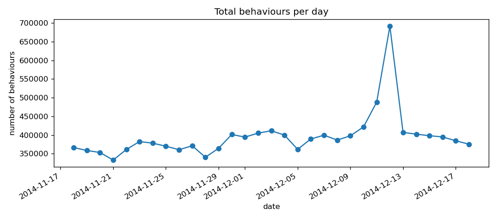
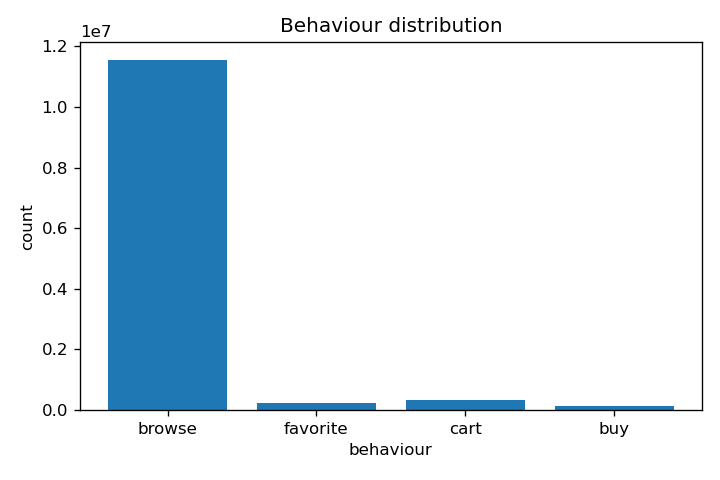
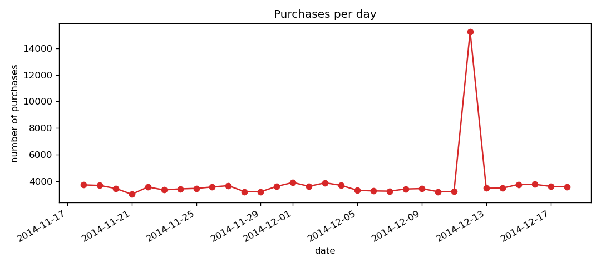
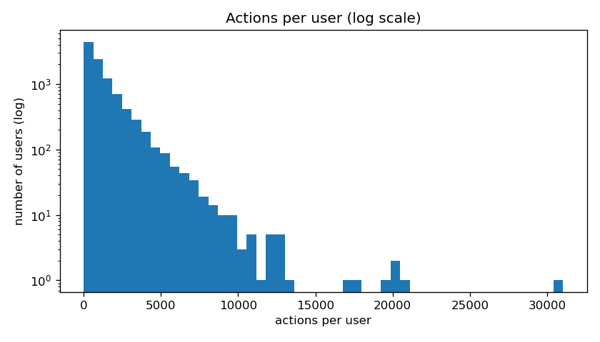

# 01 — Exploration Report

## A. Integrity checks

| Check | Result |
|---|---|
| Rows in MySQL table | 12,256,906 |
| Data rows in CSV (excl. header) | 12,256,906 |
| Row count matches file | yes |
| Missing/empty values (any column) | 0 |
| behavior_type values present | [1, 2, 3, 4] |
| Time range | 2014-11-18 00:00:00 → 2014-12-18 23:00:00 |
| Hour range | 00–23 |
| NULL timestamps | 0 |
| Exact-duplicate rows (kept, not removed) | 6,043,527 |
| Items with >1 category | 0 |

> No quality issue identified. Notably, around half of rows are duplicates.

## B. Key statistics

| Metric | Value |
|---|---|
| Distinct users | 10,000 |
| Distinct items | 2,876,947 |
| Distinct categories | 8,916 |
| Total purchase events | 120,205 |
| Distinct (user,item) buy pairs | 102,996 |
| Distinct (user,item) pairs overall | 4,686,904 |
| Of all pairs, fraction that ever buy | 2.198% |
| Users with ≥1 purchase | 8,886 of 10,000 |
| Items never purchased (cold) | 2,784,194 of 2,876,947 |
| Avg distinct items per user | 468.7 |

### Behaviour distribution (the funnel)

| behaviour | count | share |
|---|---|---|
| browse | 11,550,581 | 94.24% |
| favorite | 242,556 | 1.98% |
| cart | 343,564 | 2.80% |
| buy | 120,205 | 0.98% |

### Actions per user

| percentile | actions |
|---|---|
| 50th (median) | 747 |
| 90th | 2875 |
| 99th | 7096 |
| max | 31030 |

> Buy < Favorite < Cart, 97% items never bought.

## Charts

> Dec 12th enormous spike

---
Time Range: *(`data.date_start: 2014-11-18`, `data.date_end: 2014-12-18`).*
